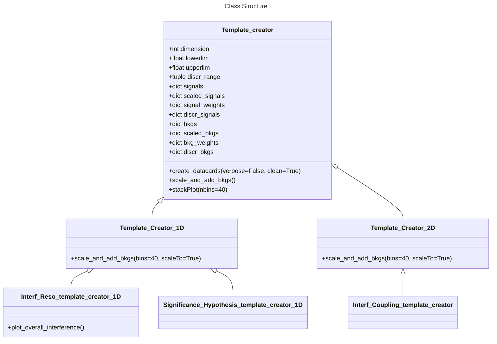

# Template Creation for Higgs Combine

This repository holds a class that is designed to create templates for Higgs Combine. It will generate the histograms for Combine, as well as the datacards required for both a 1-dimensional fit using $m_{4\mu}$, and a 2-dimensional fit using both $m_{4\mu}$ and an optimal observable discriminant (ex: $D_{0-}$).

## Dependencies
- You will need following packages. Some packages have dependencies (which are not listed). I would recommend using conda to do any package installations, as it will automatically download any dependencies you may need. For packages that require a conda installation, the conda webpage for each package required is linked below:
  - [numpy](https://anaconda.org/anaconda/numpy)
  - [matplotlib](https://anaconda.org/conda-forge/matplotlib)
  - [pandas](https://anaconda.org/anaconda/pandas)
  - [ROOT](https://anaconda.org/conda-forge/root/)
  - [uproot](https://anaconda.org/conda-forge/uproot)
  - [mplhep](https://anaconda.org/conda-forge/mplhep)

- Some of the packages are also packages that come with a default installation of Python. These packages, alongside their documentation, are listed below:
  - [os](https://docs.python.org/3/library/os.html)
  - [re](https://docs.python.org/3/library/re.html)
  - [time](https://docs.python.org/3/library/time.html)
  - [glob](https://docs.python.org/3/library/glob.html)
  - [sys](https://docs.python.org/3/library/sys.html)
  - [shutil](https://docs.python.org/3/library/shutil.html)

## How to use this package

The `Template_creator.py` function holds the majority of the content in this package. It contains classes for select 1d and 2d Templates, all inheriting from the same parent 1d and 2d template classes. Further development comes as is necessary.

